## 1. 시스템 개요

### 1.1 프로젝트 소개

**LG전자 멤버십**은 LG전자 제품을 구매한 고객들에게 제공되는 프리미엄 혜택 플랫폼입니다. 본 시스템은 멤버십 등급에 따른 차별화된 쿠폰 혜택, 프리미엄 공간 예약, 특별 이벤트 참여 등 다양한 서비스를 제공합니다.

### 1.2 주요 목표

- **고객 가치**: 고객 멤버십 등급에 따른 차별화된 혜택 제공
- **사용성**: 직관적이고 편리한 모바일 앱 인터페이스
- **공정성**: 투명하고 공정한 혜택 배분 및 추첨 시스템
- **확장성**: 새로운 혜택과 서비스 추가가 용이한 아키텍처

### 1.3 핵심 기능

1. **쿠폰 시스템**
   - 멤버십 등급별 차등 혜택
   - 아트센터 공연, LG 트윈스 티켓, 구독 리워드 등 다양한 쿠폰

2. **예약 시스템**
   - 프리미엄 라운지, 아트센터, 팝업스토어 등 프리미엄 공간 예약
   - 멤버십 등급별 우선 예약 및 전용 공간
   - 실시간 예약 현황 조회 및 관리

3. **추첨 시스템**
   - 이벤트 경품 및 인기 예약 추첨
   - 공정한 추첨 알고리즘
   - 추첨 결과의 투명한 공개

4. **기타 주요 기능**
   - 차량 등록 시스템 (프리미엄 주차 서비스)
   - 리워드 설문 (맞춤형 서비스)
   - 위치 기반 서비스 (가까운 매장 찾기)
   - 포인트 관리 시스템 (포인트 조회 및 선물하기)

### 1.4 기술 스택 개요

- **백엔드**: Node.js (Fastify), TypeScript
- **프론트엔드**: React + TypeScript (관리자 포털)
- **모바일 앱**: Flutter (LG전자 멤버십 앱)
- **데이터베이스**: PostgreSQL (PostGIS), Redis
- **API**: tRPC (Type-safe API)
- **인프라**: AWS Multi-VPC, ECS (EC2 Node Groups), Direct Connect, WAF/ALB
- **보안**: SHA512/2FA(관리자), JWT/AES-256/KISA SEED(앱 서비스)

### 1.5 모바일 애플리케이션

**LG전자 멤버십** 앱은 Flutter로 개발되어 iOS와 Android 플랫폼에서 제공됩니다.

- **Android**: [Google Play Store](https://play.google.com/store/apps/details?id=com.lge.lgemembership&hl=ko)
- **iOS**: [Apple App Store](https://apps.apple.com/kr/app/lg%EC%A0%84%EC%9E%90-%EB%A9%A4%EB%B2%84%EC%8B%AD/id1406622899)

---

## 2. 시스템 아키텍처

### 2.1 인프라 구성도

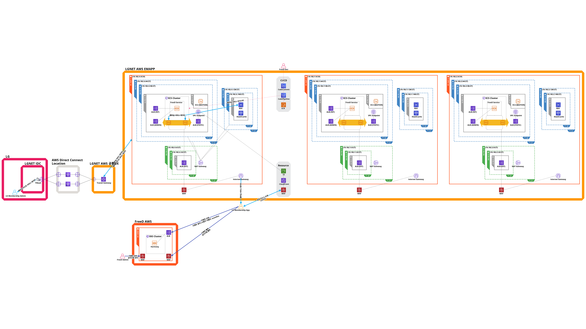

### 2.2 AWS 3-Tier 아키텍처

본 시스템은 AWS 클라우드 환경에서 고가용성과 확장성을 보장하는 3-Tier 아키텍처로 구성되어 있습니다. 각 VPC(INT/PROD)별로 독립적인 환경이 구성되어 있으며, Direct Connect와 LGNET IDC를 통해 온프레미스 시스템과 안전하게 연결됩니다.

#### 계층별 구성

1. **프레젠테이션 계층**
   - AWS CloudFront를 통한 정적 콘텐츠 제공
   - React 기반 관리자 포털
   - Flutter 기반 모바일 앱 (App Store/Play Store 배포)

2. **애플리케이션 계층**
   - ECS 클러스터 (EC2 Node Groups 기반)
   - Auto Scaling을 통한 탄력적 확장
   - ALB (Application Load Balancer)를 통한 부하 분산

3. **데이터 계층**
   - RDS PostgreSQL (Multi-AZ 구성)
   - ElastiCache Redis (세션 및 캐시)
   - S3 (정적 파일 저장소)

#### 보안 구성

- **WAF (Web Application Firewall)**: SQL Injection, XSS 등 웹 공격 차단
- **VPC (Virtual Private Cloud)**: 네트워크 격리 및 보안 그룹을 통한 접근 제어
- **KMS (Key Management Service)**: 데이터 암호화 키 관리
- **Secrets Manager**: 데이터베이스 자격 증명 등 민감 정보 관리

### 2.3 애플리케이션 아키텍처

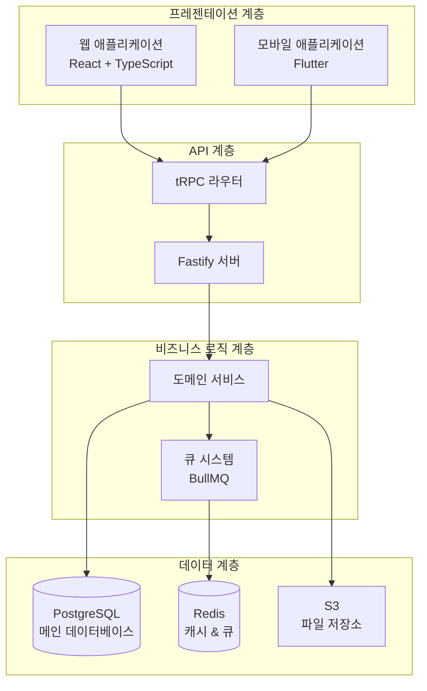

### 2.4 시스템 연동 구성

본 시스템은 AWS Direct Connect Transit Gateway를 통해 LG 온프레미스 시스템과 안전하게 연동되며, 하모니 이벤트 시스템과 통합하여 운영됩니다.

#### 2.4.1 LG 온프레미스 시스템 연동

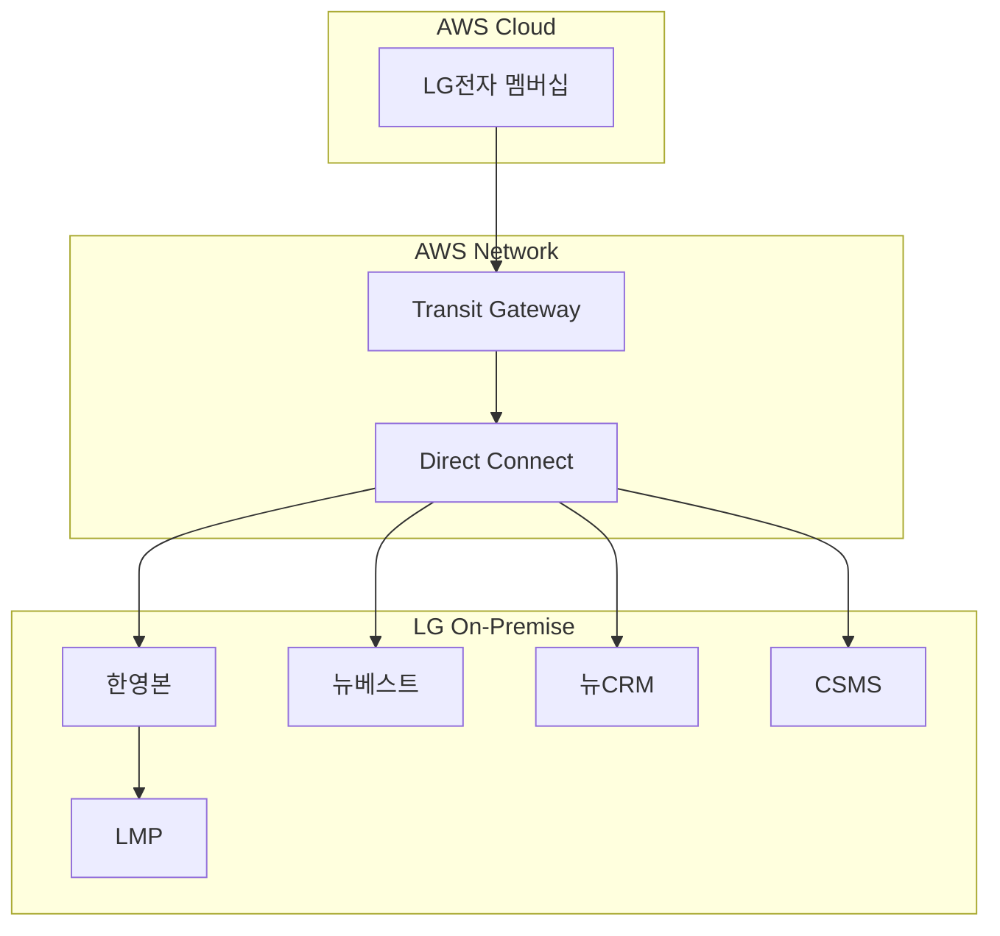

**주요 연동 시스템:**

1. **한영본 (Account System)**
   - **기능**: 회원 인증 및 세션 관리
   - **주요 API**:
     - 회원세션 토큰 발급/조회/갱신
     - 회원 정보 조회
     - 마케팅/위치정보 약관 동의 관리
   - **엔드포인트**:
     - dev: `https://accountdev.lge.co.kr`
     - stg: `https://accountstg.lge.co.kr`
     - prd: `https://account.lge.co.kr`
   - **인증**: X-LG-CLIENT-ID/SECRET, AES 암호화

2. **뉴베스트 (NewBest)**
   - **기능**: 멤버십 정보 및 혜택 관리
   - **주요 API**:
     - 멤버십 고객정보 및 등급 조회
     - 멤버십 쿠폰 조회 (주차/무상이전/OBS)
     - 멤버십 포인트 조회 및 선물하기
   - **엔드포인트**:
     - dev: `http://10.185.217.196:8180`
     - stg: `http://qanewbest.lge.com`
     - prd: `https://newbest.lge.com`
   - **인증**: API Key, SEED 암호화

3. **뉴CRM (NewCRM)**
   - **기능**: 고객 구매 정보 관리
   - **주요 API**:
     - 제품 구매내역 조회
     - 3년 무상서비스 대상제품 조회
   - **엔드포인트**:
     - dev/stg: `https://dev-apigw-ext.lge.com:7221`
     - prd: `https://apigw-ext.lge.com:7211`
   - **인증**: X-GATEWAY-APIKEY

4. **CSMS**
   - **기능**: 고객 서비스 관리
   - **주요 API**:
     - 고객계약 조회 (일반/간략/상세)
     - 방문일정 조회
     - 수금정보 조회
   - **엔드포인트**:
     - dev: `http://devcsms.lge.com`
     - stg: `http://qacsms.lge.com:83`
     - prd: `https://csms.lge.com:447`
   - **인증**: X-CSMS-CLIENT-ID, SEED 암호화

#### 2.4.2 하모니 이벤트 시스템 연동

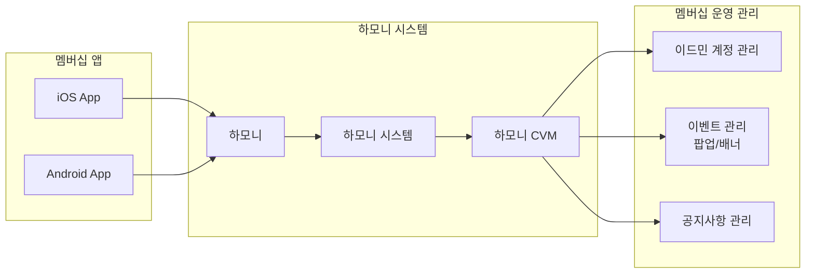

**하모니 연동 기능:**

- **통합회원 관리**: 회원 가입, 로그인, 정보 수정
- **이벤트 관리**: 팝업 및 배너 이벤트 설정
- **공지사항 관리**: 앱 내 공지사항 등록 및 관리
- **마케팅 정보 수집**: 회원 활동 데이터 수집 및 분석

#### 2.4.3 연동 보안 및 관리

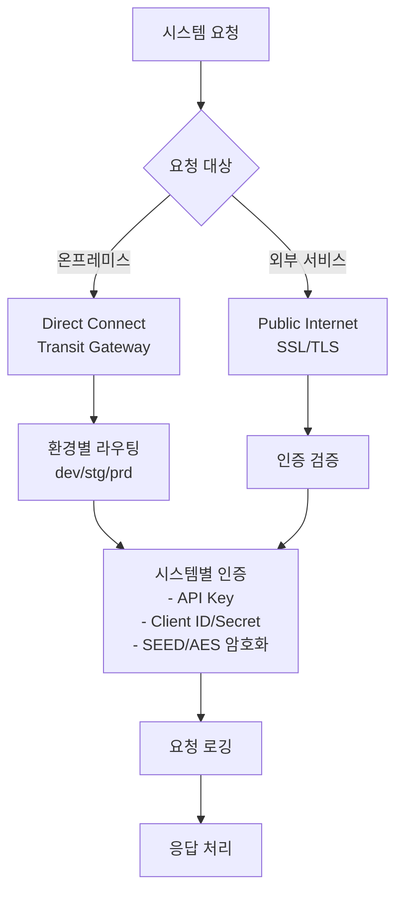

**보안 정책:**

- **네트워크 보안**: AWS Direct Connect Transit Gateway를 통한 전용선 연결
- **환경 분리**: dev/stg/prd 환경별 독립적인 엔드포인트
- **인증 방식**:
  - API Key 기반 인증
  - Client ID/Secret 인증
  - SEED/AES 암호화
- **데이터 보안**:
  - 전 구간 SSL/TLS 암호화
  - 민감 정보 암호화 저장
  - 요청/응답 로깅

---

## 3. 주요 기능

### 3.1 쿠폰 시스템

#### 3.1.1 기능 개요

쿠폰 시스템은 멤버십 등급별로 차등화된 혜택을 제공하며, 다양한 서비스 이용 시 할인 및 무료 이용 혜택을 지원합니다.

#### 3.1.2 쿠폰 종류

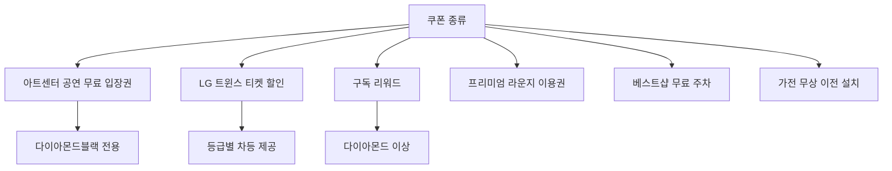

#### 3.1.3 멤버십 등급별 쿠폰 혜택

| 등급                 | 아트센터 공연 | LG 트윈스 할인 | 구독 리워드 | 프리미엄 라운지  | 베스트샵 주차    |
| -------------------- | ------------- | -------------- | ----------- | ---------------- | ---------------- |
| 실버(AS05/AS04)      | -             | -              | -           | -                | -                |
| 골드(AS03)           | -             | 연 2회         | -           | 일반(월 3회)     | -                |
| 플래티넘(AS02)       | -             | 연 4회         | -           | 일반(월 3회)     | -                |
| 다이아몬드(AS01)     | -             | 월 4회         | 1회         | 프리미엄(월 3회) | 일반(월 3회)     |
| 다이아몬드블랙(AS00) | 1회           | 월 6회         | 1회         | 프리미엄(월 3회) | 프리미엄(월 3회) |

#### 3.1.4 쿠폰 발급 및 사용 프로세스

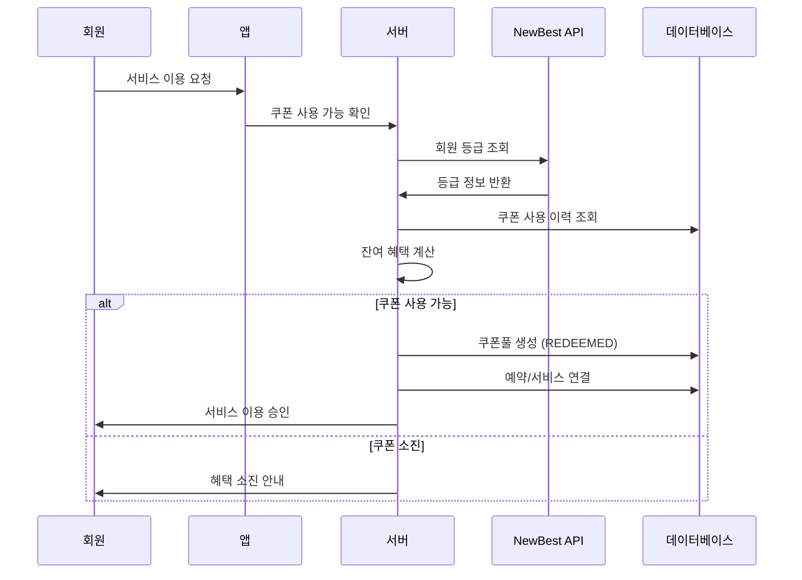

#### 3.1.5 쿠폰 상태 관리

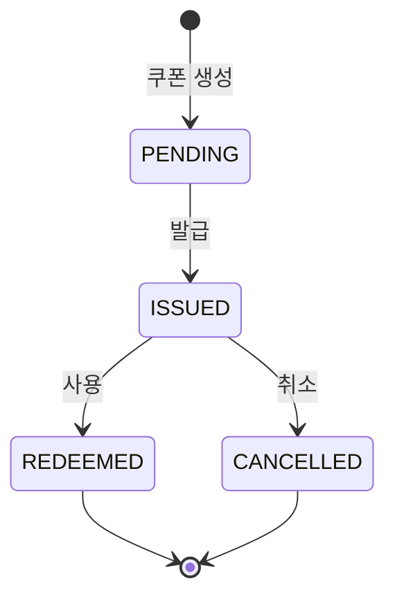

**쿠폰 상태:**

- **PENDING**: 발급 대기
- **ISSUED**: 발급 완료
- **REDEEMED**: 사용 완료
- **CANCELLED**: 취소

### 3.2 예약 시스템

#### 3.2.1 기능 개요

예약 시스템은 프리미엄 라운지, 아트센터, 팝업스토어 등 LG전자가 제공하는 다양한 프리미엄 공간과 서비스를 고객들이 편리하게 예약할 수 있도록 지원합니다.

#### 3.2.2 예약 프로세스

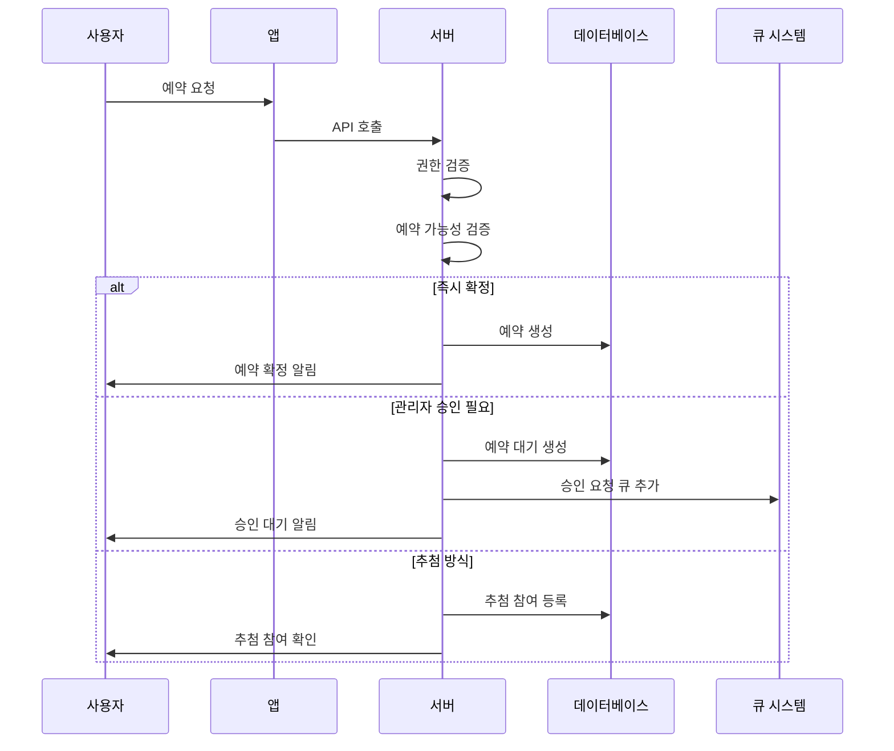

#### 3.2.3 주요 특징

1. **다양한 예약 확정 방식**
   - **즉시 확정**: 선착순 예약
   - **관리자 승인**: 특별 공간에 대한 승인 절차
   - **추첨 방식**: 인기 시간대/공간에 대한 공정한 배분

2. **유연한 예약 오픈 방식**
   - **일괄 오픈**: 특정 시점에 모든 예약 동시 오픈
   - **순차 오픈**: N일 전부터 순차적 오픈

3. **멤버십 등급별 차등 서비스**
   - 등급별 월 이용 횟수 제한
   - 프리미엄 공간 접근 권한
   - 우선 예약 혜택

4. **스마트 예약 관리**
   - 실시간 잔여석 확인
   - 예약 변경/취소 (시작 24시간 전까지)
   - 노쇼 방지 시스템

### 3.3 추첨 시스템

#### 3.3.1 기능 개요

추첨 시스템은 이벤트 경품 및 인기 예약(특별 공간, 인기 시간대)에 대해 공정하고 투명한 방식으로 당첨자를 선정합니다. 하나의 추첨에 대해 여러 번의 추첨 실행이 가능하며, 각 실행마다 다른 경품 구성과 참여자로 유연하게 운영할 수 있습니다.

#### 3.3.2 추첨 실행 프로세스

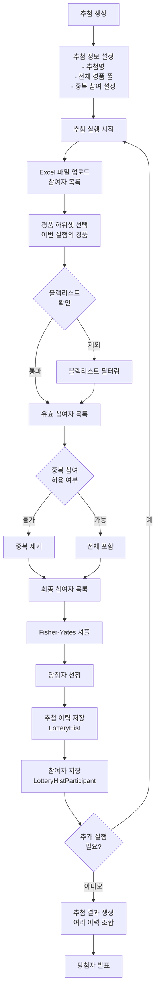

#### 3.3.3 주요 특징

1. **유연한 추첨 운영**
   - **추첨 생성**: 전체 경품 풀 정의 (예: A상품 100개, B상품 50개)
   - **추첨 실행**: 각 실행마다 경품 하위셋 선택 가능 (예: 1차-A상품 30개, 2차-B상품 20개)
   - **참여자 관리**: Excel 업로드 방식으로 각 실행마다 다른 참여자 가능
   - **결과 생성**: 여러 추첨 이력을 조합하여 최종 당첨자 발표

2. **공정한 추첨 알고리즘**
   - Fisher-Yates 셔플 알고리즘 사용
   - 완전 무작위 선정 보장
   - 추첨 과정 로그 기록

3. **블랙리스트 관리**
   - 부정 사용자 추첨 참여 제한
   - 블랙리스트 회원도 참여자로 기록 (isBanned 플래그)
   - 사유 기록 및 이력 관리

4. **중복 참여 제어**
   - 추첨별 중복 참여 허용/불허 설정
   - 동일 회원번호 중복 제거 기능
   - 유연한 정책 적용

5. **데이터 보유 정책**
   - 개인정보 보호를 위한 90일 자동 삭제
   - 추첨 생성 시점 기준 보유 기간 계산
   - 감사 로그 별도 보관

6. **추첨 결과 관리**
   - 추첨 이력별 상세 기록 보관
   - 여러 이력을 조합한 통합 결과 생성
   - 당첨자 발표 및 관리

### 3.4 기타 주요 기능

#### 3.4.1 차량 등록 시스템

회원별 차량 정보를 등록하여 프리미엄 주차 서비스 등에 활용합니다.

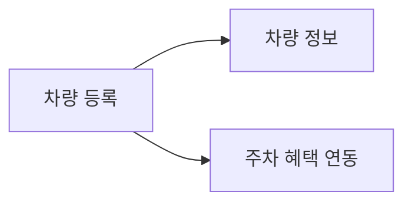

#### 3.4.2 리워드 설문

고객에게 맞춤형 설문을 제공하고, 참여 시 리워드를 지급하는 서비스입니다.

**주요 특징:**

- **설문 유형**: 객관식(단일/다중선택), 주관식, 날짜 선택 등 다양한 형태
- **보상 체계**: 설문 참여 완료 시 포인트 또는 쿠폰 지급
- **타겟팅**: 회원 등급, 구매 이력 등을 고려한 맞춤형 설문 제공
- **데이터 활용**: 수집된 정보를 바탕으로 개인화된 혜택 추천

#### 3.4.3 위치 기반 서비스

PostGIS를 활용하여 사용자 위치 기반의 서비스를 제공합니다.

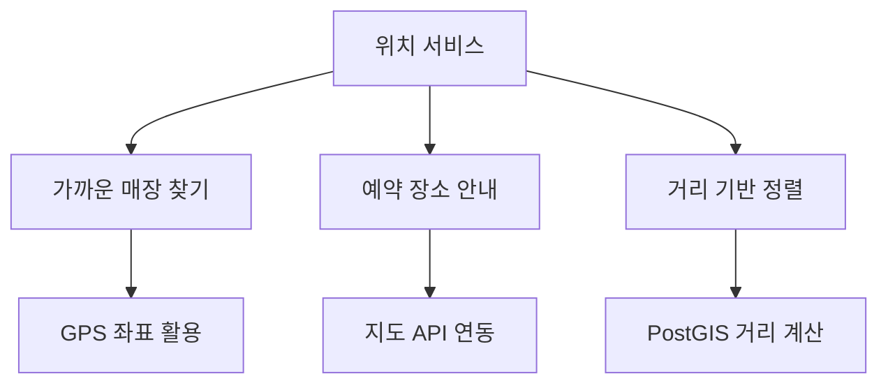

#### 3.4.4 포인트 관리 시스템

회원의 포인트를 조회하고 선물하기 기능을 제공하는 통합 포인트 관리 시스템입니다.

**주요 기능:**

- **포인트 조회**: 보유 포인트 실시간 확인
- **포인트 이력**: 적립/사용 내역 상세 조회
- **포인트 선물하기**: 다른 회원에게 포인트 전송
- **포인트 전환**: 쿠폰 또는 다른 혜택으로 교환

---

## 4. 시스템 구성 상세

### 4.1 애플리케이션 구조

#### 4.1.1 Monorepo 구조

```
EMAPP-LGE-Repo/
├── apps/
│   └── emapp/                 # 메인 애플리케이션
├── packages/                   # 공유 패키지
│   ├── @freed/2fa/            # 2단계 인증
│   ├── @freed/aws/            # AWS 서비스 통합
│   ├── @freed/bullmq/         # 큐 시스템
│   ├── @freed/jwt/            # JWT 인증
│   ├── @freed/prisma/         # ORM 설정
│   └── ...
└── infrastructure/            # 인프라 코드
```

#### 4.1.2 모바일 앱 구조

LG전자 멤버십 앱은 다음과 같은 주요 기능으로 구성됩니다:

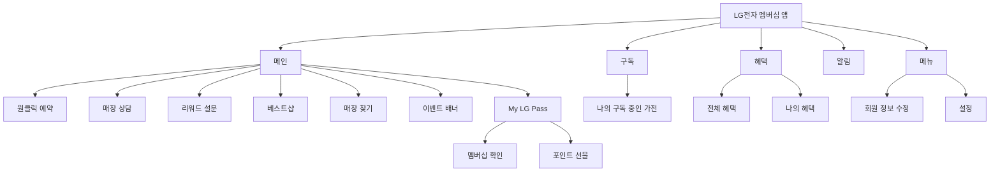

#### 4.1.3 어드민 구조

관리자 시스템은 다음과 같은 주요 모듈로 구성됩니다:

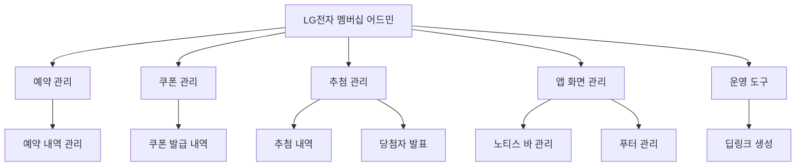

### 4.2 데이터베이스 설계

#### 4.2.1 주요 엔티티 관계도

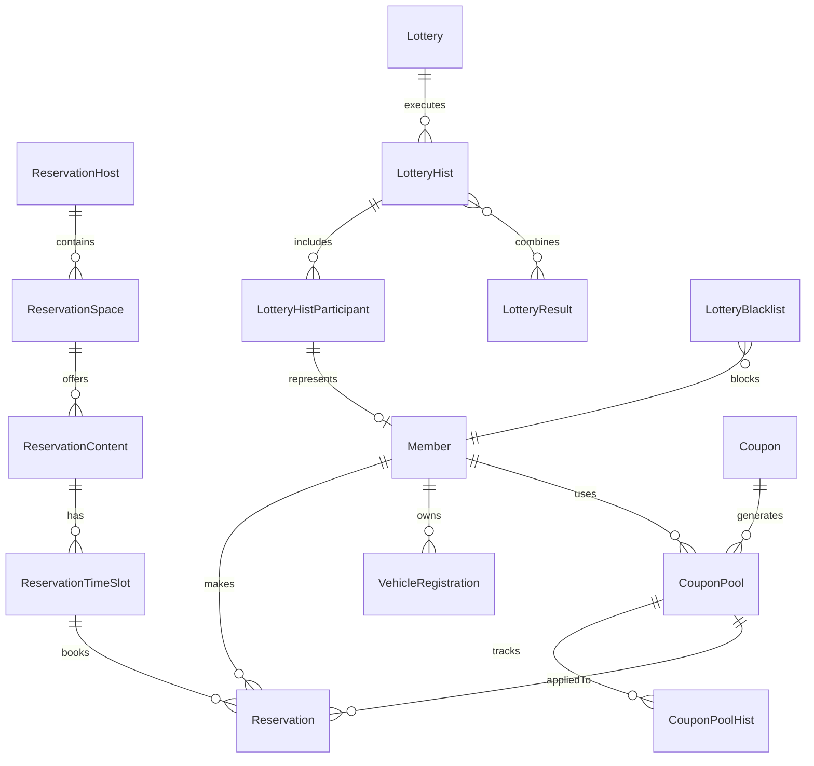

#### 4.2.2 핵심 테이블

1. **회원 관리**
   - `Member`: 회원 기본 정보 (CI, 이름, 연락처 등)
   - `Admin`: 관리자 계정 정보
   - `AdminPasswordHist`: 관리자 비밀번호 이력
   - `AdminTrail`: 관리자 활동 로그
   - `VehicleRegistration`: 회원 차량 등록 정보

2. **예약 시스템**
   - `Reservation`: 예약 정보
   - `ReservationHost`: 예약 호스트 (라운지, 아트센터 등)
   - `ReservationSpace`: 호스트별 공간 정보
   - `ReservationContent`: 예약 가능한 콘텐츠
   - `ReservationTimeSlot`: 예약 시간대 설정

3. **추첨 시스템**
   - `Lottery`: 추첨 정의 (추첨명, 전체 경품 풀, 중복 참여 설정)
   - `LotteryHist`: 추첨 실행 이력 (실행별 경품 하위셋, 참여자 수, 당첨자 수)
   - `LotteryHistParticipant`: 추첨 실행별 참여자 정보 (당첨 여부, 블랙리스트 여부)
   - `LotteryResult`: 추첨 결과 발표 (여러 LotteryHist 조합)
   - `LotteryBlacklist`: 추첨 참여 제한 명단

4. **쿠폰 시스템**
   - `Coupon`: 쿠폰 정의 (종류, 유효기간, 할인 정보)
   - `CouponPool`: 발급된 쿠폰 인스턴스
   - `CouponPoolHist`: 쿠폰 사용 이력

5. **기타 주요 테이블**
   - `Location`: 매장 위치 정보 (PostGIS 활용)
   - `AppSetting`: 앱 설정 정보 (공지바, 푸터 등)
   - `DownloadLink`: 대용량 데이터 다운로드 링크
   - `Activity`: 활동 로그
   - `Terms`: 약관 정보
   - `TermsAgreement`: 약관 동의 내역
   - `Maintenance`: 시스템 점검 정보

### 4.3 보안 아키텍처

#### 4.3.1 인증/인가 체계

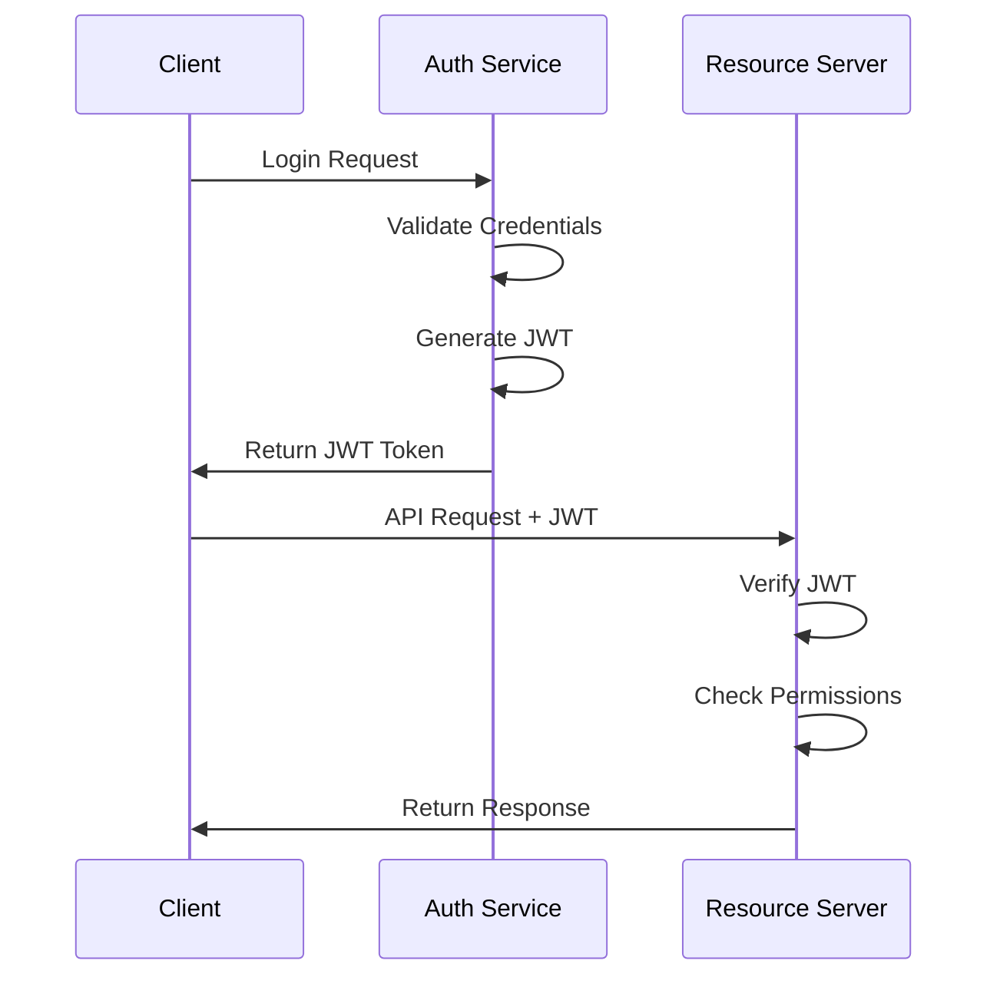

#### 4.3.2 보안 기능

1. **인증 체계**
   - JWT 기반 인증 (RS256 비대칭키 / HS256 대칭키)
   - Access Token & Refresh Token 분리 운영
   - 발급자(issuer): membership.lge.co.kr

2. **접근 제어**
   - 역할 기반 접근 제어 (RBAC): ADMIN, STAFF, MEMBER
   - 리소스별 세분화된 권한 관리
   - IP 기반 세션 관리

3. **데이터 보안**
   - KISA SEED 암호화 (CBC/ECB 모드)
   - TLS 1.2+ 전송 구간 암호화
   - 민감 정보 자동 마스킹 처리

4. **추가 보안 기능**
   - 2단계 인증 (2FA): 이메일 방식
   - 본인인증: NICE CP, PASS 인증
   - 감사 로그 자동 기록
   - 인증 실패 시 계정 잠금 (5회 시도 제한)

---

## 5. 운영 및 모니터링

### 5.1 배포 프로세스

#### 5.1.1 AWS CodePipeline CI/CD

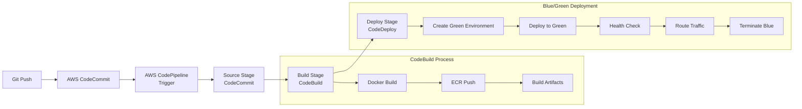

#### 5.1.2 블루/그린 배포 전략

**배포 프로세스:**

1. **Blue Environment**: 현재 운영 중인 환경
2. **Green Environment**: 새 버전이 배포될 환경
3. **Traffic Shifting**: ALB를 통한 트래픽 전환
4. **Rollback**: 문제 발생 시 즉시 Blue로 복귀 가능

**CodePipeline 구성:**

- **Source Stage**: AWS CodeCommit 연동
- **Build Stage**: CodeBuild로 Docker 이미지 빌드 및 ECR 푸시
- **Deploy Stage**: CodeDeploy로 ECS 블루/그린 배포 실행

#### 5.1.3 빌드 및 배포 설정

**CodeBuild (buildspec.yml)**

- Docker 이미지 빌드
- ECR 레지스트리 푸시 (925517469638.dkr.ecr.ap-northeast-2.amazonaws.com/icn-ecr-emapp)
- 빌드 아티팩트 생성

**CodeDeploy (appspec.yml)**

- ECS 블루/그린 배포
- 컨테이너 포트: 3000
- 트래픽 라우팅: ALB Target Group 전환
- 배포 검증: Health Check 통과 후 트래픽 전환

#### 5.1.4 환경별 구성

| 환경 | 용도     | 특징                   | AWS Secrets Manager |
| ---- | -------- | ---------------------- | ------------------- |
| dev  | 개발     | 빠른 배포 주기         | icn-sm-emapp/dev    |
| stg  | 스테이징 | 운영 환경 미러링       | icn-sm-emapp/stg    |
| prd  | 운영     | Multi-AZ, Auto Scaling | icn-sm-emapp/prd    |

### 5.2 모니터링 체계

1. **애플리케이션 모니터링**
   - ECS 태스크 메트릭 (CPU, 메모리 사용률)
   - 컨테이너 상태 모니터링
   - 애플리케이션 로그 수집

2. **인프라 모니터링**
   - CloudWatch 메트릭
   - EC2 인스턴스 상태
   - RDS 성능 지표
   - ALB 헬스 체크 상태

3. **로그 관리**
   - CloudWatch Logs를 통한 중앙 집중식 로그 수집
   - 로그 그룹별 관리 (애플리케이션, 시스템, 액세스 로그)
   - 로그 보관 기간 설정 및 S3 아카이빙

4. **알림 설정**
   - CloudWatch 알람을 통한 임계값 모니터링
   - SNS를 통한 알림 발송
   - 주요 메트릭: CPU/메모리 사용률, API 응답 시간, 에러율
