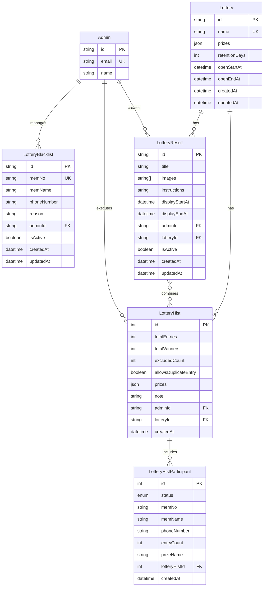

```sql
// 추첨 정의
model Lottery {
  id            String   @id @default(dbgenerated("gen_random_uuid()")) @db.Uuid
  name          String   @unique @db.VarChar(255)
  prizes        Json     // [{prizeName: string, winnerCount: number}] - 전체 경품 풀
  retentionDays Int      @default(90) // 기본 90일 (스케줄러가 이 값을 참조하여 데이터 삭제)
  openStartAt   DateTime // 응모 시작일
  openEndAt     DateTime // 응모 종료일

  hists   LotteryHist[]
  results LotteryResult[]

  createdAt DateTime @default(now())
  updatedAt DateTime @updatedAt

  @@map(name: "lottery")
}

// 추첨 블랙리스트
model LotteryBlacklist {
  id          String  @id @default(dbgenerated("gen_random_uuid()")) @db.Uuid
  memNo       String  @unique @db.VarChar(255)
  memName     String? @db.VarChar(255)
  phoneNumber String? @db.VarChar(20)
  reason      String?

  admin   Admin?  @relation(fields: [adminId], references: [id])
  adminId String? @db.Uuid

  isActive  Boolean  @default(true)
  createdAt DateTime @default(now())
  updatedAt DateTime @updatedAt

  @@index([memNo, isActive]) // 활성 블랙리스트 조회 성능 향상
  @@map(name: "lotteryBlacklist")
}

// 추첨 참여자 상태
enum LotteryParticipantStatus {
  WINNER               // 당첨
  NOT_WINNER          // 미당첨
  EXCLUDED_PREV_WINNER // 이전 당첨자로 제외
  EXCLUDED_BLACKLIST   // 블랙리스트로 제외
}

// 추첨 이력 참여자
model LotteryHistParticipant {
  id          Int                      @id @default(autoincrement())
  status      LotteryParticipantStatus @default(NOT_WINNER) // 참여자 상태
  memNo       String                   @db.VarChar(255)
  memName     String?                  @db.VarChar(255)
  phoneNumber String?                  @db.VarChar(20)
  entryCount  Int                      @default(1) // 참여 횟수
  prizeName   String?                  @db.VarChar(255) // 당첨 시

  lotteryHist   LotteryHist @relation(fields: [lotteryHistId], references: [id])
  lotteryHistId Int

  createdAt DateTime @default(now())

  @@index([lotteryHistId]) // 추첨 이력별 조회용
  @@index([lotteryHistId, status]) // 추첨 이력별 상태별 조회용
  @@index([lotteryHistId, memName]) // 추첨 이력별 회원명 검색용
  @@map(name: "lotteryHistParticipant")
}

// 추첨 실행 이력
model LotteryHist {
  id                   Int     @id @default(autoincrement())
  totalEntries         Int     // 전체 참여 횟수
  totalWinners         Int     // 총 당첨자 수
  excludedCount        Int     @default(0) // 제외된 참여 횟수
  allowsDuplicateEntry Boolean @default(false) // 중복 참여 허용 여부 (추첨 실행별 설정)
  prizes               Json    // 경품 하위셋 [{prizeName, winnerCount}]
  note                 String?

  admin        Admin?                   @relation(fields: [adminId], references: [id])
  adminId      String?                  @db.Uuid
  lottery      Lottery                  @relation(fields: [lotteryId], references: [id])
  lotteryId    String                   @db.Uuid
  participants LotteryHistParticipant[]
  results      LotteryResult[]          // N:M 관계

  createdAt DateTime @default(now())

  @@index([lotteryId]) // 추첨별 이력 조회용
  @@map(name: "lotteryHist")
}

// 추첨 결과 발표
model LotteryResult {
  id             String    @id @default(dbgenerated("gen_random_uuid()")) @db.Uuid
  title          String    @db.VarChar(255)
  images         String[]  @db.VarChar(2048)
  instructions   String?
  displayStartAt DateTime? // 결과 노출 시작일
  displayEndAt   DateTime? // 결과 노출 종료일

  admin     Admin?        @relation(fields: [adminId], references: [id])
  adminId   String?       @db.Uuid
  lottery   Lottery       @relation(fields: [lotteryId], references: [id])
  lotteryId String        @db.Uuid
  hists     LotteryHist[] // N:M 관계 - 여러 추첨 이력을 조합

  isActive  Boolean  @default(false)
  createdAt DateTime @default(now())
  updatedAt DateTime @updatedAt

  @@map(name: "lotteryResult")
}
```

## 주요 엔티티 설명

### 1. Lottery (추첨 정의)

- 추첨의 기본 정보와 전체 경품 풀을 관리하는 테이블
- `prizes`: JSON 형태로 전체 경품 풀 저장: `[{prizeName: string, winnerCount: number}]`
- `retentionDays`: 개인정보 보유 기간 (기본 90일)
- `openStartAt`, `openEndAt`: 응모 기간 설정
- 하나의 추첨에 대해 여러 번의 실행(LotteryHist) 가능
- **중요**: 관련 이력이나 결과가 있으면 삭제 불가 (Restrict 관계)

### 2. LotteryHistParticipant (추첨 이력 참여자)

- 각 추첨 실행의 참여자 정보 (memNo당 하나의 레코드)
- `status`: 참여자 상태 (WINNER, NOT_WINNER, EXCLUDED_PREV_WINNER, EXCLUDED_BLACKLIST)
- `entryCount`: 해당 참여자의 참여 횟수 (중복 참여 시)
- `memName`, `phoneNumber`는 선택적 필드
- `prizeName`: 당첨된 경우 상품명
- `lotteryHistId`: 참여한 추첨 실행 ID

### 3. LotteryHist (추첨 실행 이력)

- 추첨 실행 이력을 관리
- `totalEntries`: 전체 참여 횟수 (중복 포함)
- `allowsDuplicateEntry`: 해당 실행의 중복 참여 허용 여부
- `prizes`: 실행별 경품 하위셋 (실제 당첨 결과가 아닌 실행 시 요청한 경품 구성)
  ```json
  [
    {
      "prizeName": "상품A",
      "winnerCount": 10  // 목표 당첨자 수
    }
  ]
  ```
- `excludedCount`: 제외된 참여 횟수 (블랙리스트, 이전 당첨자)
- `note`: 추첨 실행 시 남긴 메모
- LotteryResult와 N:M 관계 (여러 결과 발표에서 참조 가능)

### 4. LotteryResult (추첨 결과 발표)

- 당첨자 발표 페이지 정보
- 결과 노출 기간만 관리 (응모 기간은 Lottery로 이동)
- 여러 추첨 이력(LotteryHist)을 하나의 결과로 통합하여 발표 (N:M 관계)
- `link` 필드 제거됨

### 5. LotteryBlacklist (블랙리스트)

- 추첨에서 제외할 회원 관리
- `memName`, `phoneNumber`는 선택적 필드
- `isActive`: 활성화 상태인 경우만 추첨에서 제외

## 인덱스

- `LotteryHistParticipant`:
  - `(lotteryHistId)` - 추첨 이력별 조회
  - `(lotteryHistId, status)` - 추첨 이력별 상태별 조회
  - `(lotteryHistId, memName)` - 추첨 이력별 회원명 검색
- `LotteryBlacklist`:
  - `(memNo, isActive)` - 활성 블랙리스트 조회
- `LotteryHist`:
  - `(lotteryId)` - 추첨별 이력 조회

## 주요 비즈니스 로직

### 1. 추첨 생성 및 실행

1. **추첨 생성**:
   - 전체 경품 풀 정의 (예: A상품 100개, B상품 50개)
   - 응모 기간 설정 (openStartAt ~ openEndAt)
   - 상품명 중복 검증

2. **추첨 실행**:
   - 참여자 업로드 (API로 전달)
   - 경품 하위셋 선택 (예: 이번엔 A상품 30개만)
   - 실행별 중복 참여 허용 여부 설정
   - 상품명 중복 검증
   - 참여자 필터링 (최적화된 순서):
     a. 참여자별 entryCount 집계 (Map 자료구조 사용)
     b. 블랙리스트와 이전 당첨자 동시 조회 (Promise.all, IN clause)
     c. 상태별 분류 (EXCLUDED_BLACKLIST, EXCLUDED_PREV_WINNER 등)
     d. 유효 참여자만 추첨 대상으로 설정
   - Fisher-Yates 알고리즘으로 무작위 당첨자 선정
   - 각 memNo당 하나의 레코드로 저장 (entryCount로 중복 표현)
   - 트랜잭션 격리 수준: Serializable (동시 추첨 실행 시 데이터 무결성 보장)

### 2. 추첨 결과 생성

- 여러 추첨 실행(LotteryHist)을 조합하여 하나의 결과 생성
- 동일 추첨(lotteryId)의 이력만 조합 가능
- 최종 당첨자 발표

### 3. 데이터 관리

- **참여자 데이터**: 블랙리스트 포함 모든 참여자 기록 보존
- **중복 처리**: 추첨 실행별로 유연하게 설정 가능
- **개인정보 보호**: 
  - 설정된 보유 기간(기본 90일) 후 Cron Job이 자동 삭제
  - 매일 KST 00:45 실행 (`cronLotteryCleanup`)
  - Raw Query로 만료된 데이터 효율적 조회
  - 참여자 개인정보만 삭제, 통계 데이터(LotteryHist)는 유지
- **데이터 무결성**: onDelete Restrict로 관련 데이터가 있으면 삭제 방지

### 4. 성능 최적화

- **쿼리 최적화**: 
  - Promise.all과 IN clause를 사용한 병렬 처리
  - Raw Query 활용 (개인정보 자동 삭제)
- **메모리 효율**: 
  - Map 자료구조를 사용한 O(1) 조회
  - 중복 데이터 구조 제거
  - 참여자당 하나의 레코드로 정규화
- **트랜잭션 격리**: Serializable 수준으로 동시성 제어
- **배치 처리**: 참여자 수에 따른 동적 배치 크기 적용
- **알고리즘 개선**: O(n²) → O(n) 복잡도 개선